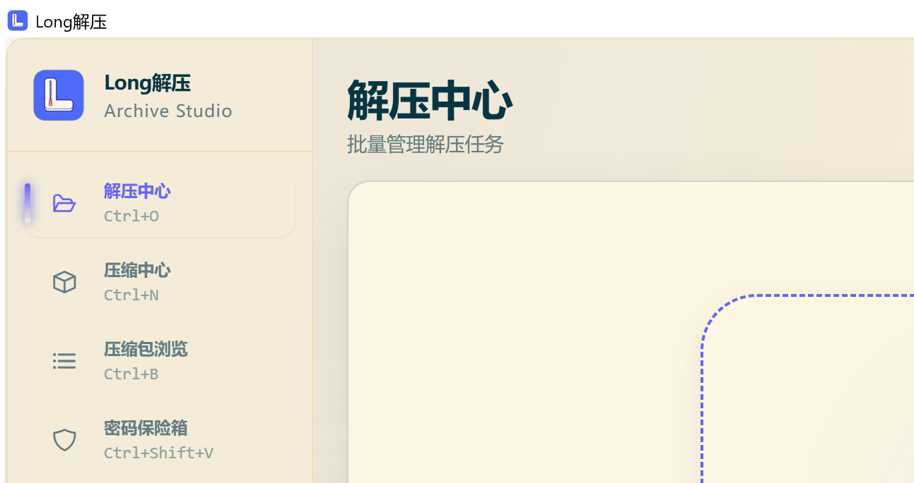
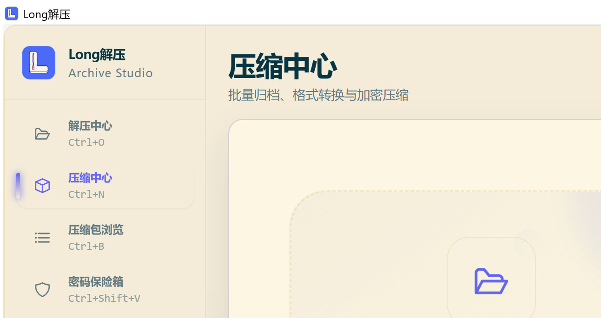
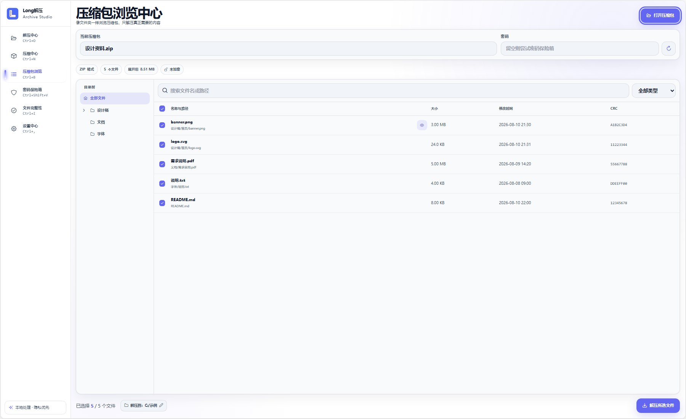
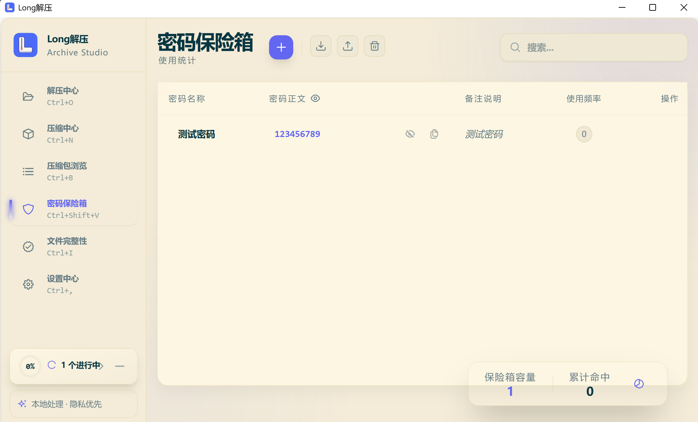
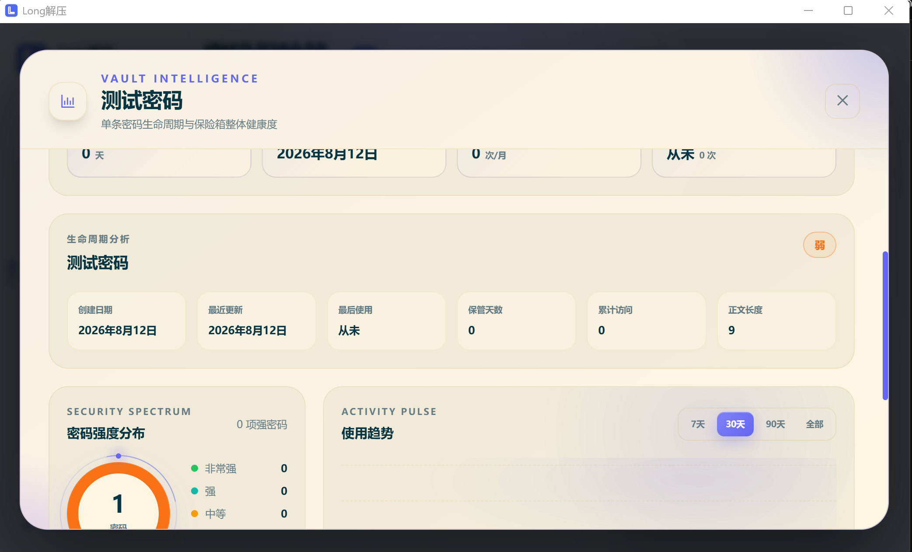

<div align="center">


# Long解压

### 面向 Windows 的本地压缩、解压、归档浏览与密码管理工具

[](https://github.com/Longyuyeee/long_Decompress/releases/latest)
[](https://github.com/Longyuyeee/long_Decompress/releases/latest)
[](LICENSE)
[](https://tauri.app)

[下载最新版](https://github.com/Longyuyeee/long_Decompress/releases/latest) ·
[快速上手](#快速上手) ·
[密码保险箱](#密码保险箱) ·
[格式支持](#格式支持) ·
[问题反馈](https://github.com/Longyuyeee/long_Decompress/issues)

</div>

---

Long解压是一款强调本地处理、清晰进度和安全落盘的 Windows 桌面归档工具。它不仅能完成日常压缩与解压，还把批量任务、压缩包浏览、密码保险箱、完整性检查、资源预检、任务模板和资源管理器右键菜单整合在同一个界面中。

当前版本：**v1.1.5**。

## 真实运行界面

以下图片直接截取自 Long解压 1.1.5 的 Windows 实际运行界面，不是设计稿或界面模型，完整展示了侧栏、主工作区、任务配置和底部操作区域。

<table>
  <tr>
    <td width="50%" align="center">
      <br>
      <strong>解压中心</strong><br>
      <sub>批量导入、配置、进度、阶段和实时日志</sub>
    </td>
    <td width="50%" align="center">
      <br>
      <strong>压缩中心</strong><br>
      <sub>多文件归档、格式转换、加密与压缩后校验</sub>
    </td>
  </tr>
  <tr>
    <td width="50%" align="center">
      <br>
      <strong>压缩包浏览中心</strong><br>
      <sub>可折叠目录树、搜索筛选、条目详情与选择性解压</sub>
    </td>
    <td width="50%" align="center">
      <br>
      <strong>密码保险箱</strong><br>
      <sub>密码名称、密码正文、备注、使用频率与数据统计统一管理</sub>
    </td>
  </tr>
  <tr>
    <td colspan="2" align="center">
      <br>
      <strong>密码生命周期分析</strong><br>
      <sub>集中查看密码强度、创建与使用周期、访问趋势及保险箱整体健康度</sub>
    </td>
  </tr>
</table>

> 截图中的密码、归档与文件名称均为功能演示数据，不代表生产环境中的真实凭证。

## 核心特色

| 能力 | 说明 |
| --- | --- |
| 批量压缩与解压 | 多任务排队执行，展示等待、处理中、校验、完成或失败状态，并保留实时日志 |
| 压缩包浏览 | 不必完整解压即可查看目录树、搜索和筛选文件，支持精确选择后解压 |
| 密码保险箱 | 本机加密保存常用解压密码，遇到加密归档时自动尝试匹配 |
| 智能压缩 | 对有限内容样本进行分析，给出格式、压缩等级和固实压缩建议，不会自动替用户执行 |
| 安全落盘 | 解压先进入暂存区，再执行路径检查、容量限制、冲突处理和原子提交，失败时尽量回滚 |
| 完整性与修复 | 计算 CRC32、MD5、SHA256，诊断归档问题，并以新文件方式非破坏修复可恢复 ZIP |
| Windows 集成 | 文件拖放、快捷键、托盘、开机启动、资源管理器右键菜单和签名校验的应用内更新 |
| 可访问性 | 多主题、强调色、界面缩放、高对比度、减少动效、焦点指示与色觉辅助选项 |

## 密码保险箱

密码保险箱是 Long解压区别于普通归档工具的重要能力。它面向“经常收到不同来源加密压缩包”的场景，减少反复查找、复制和试错密码的时间。

### 可以管理什么

- 创建、编辑、搜索和删除密码记录。
- 使用直观的“密码名称 / 密码正文 / 备注说明”字段管理内容。
- 单条显示或隐藏密码，并可一键复制密码正文。
- 按分类、标签、使用次数、最后使用时间和更新时间整理记录。
- 导入、导出或清空密码数据。
- 查看单条密码的使用历史，以及长期使用趋势、分类分布和整体统计。

### 如何参与解压

1. 当归档需要密码而任务没有手动填写密码时，Long解压会在本机查询保险箱候选。
2. 候选密码只交给本机解压引擎尝试，不上传到网络。
3. 匹配成功后会更新使用次数和历史统计，方便后续排序与分析。
4. 如果候选全部失败，任务会明确提示用户输入正确密码，而不是无限卡住。

### 本地安全设计

- 首次使用时自动创建当前安装实例的随机主密钥，界面不要求用户额外设置一个难以理解的主密码。
- 密码正文以加密形式保存在本机应用数据目录；密码保险箱和归档处理均不依赖云端服务。
- ZIP、7Z、RAR 的密码元数据处理尽量在进程内完成，不把密码拼接到普通命令行。
- 创建加密 RAR 必须调用 WinRAR；由于 RAR 编码器限制，应用会在执行前明确说明相关本机进程参数风险并要求确认。

> 密码保险箱用于归档密码管理，不是浏览器账号同步服务。请根据自己的备份策略妥善保存重要密码导出文件。

## 快速上手

### 解压文件

1. 打开“解压中心”，拖入一个或多个压缩包。
2. 选择输出目录、是否解压到同名文件夹、目录结构和冲突策略。
3. 如有需要填写密码；留空时可以使用密码保险箱候选。
4. 点击开始解压，在条目右侧查看阶段、进度和实时日志。
5. 已完成或失败任务可以统一清理，取消任务不会把未完成结果冒充为成功。

### 压缩文件或文件夹

1. 打开“压缩中心”，添加文件、文件夹或一组待归档内容。
2. 选择 ZIP、7Z、TAR 系列等格式，并设置压缩等级、输出目录和压缩包名称。
3. 可使用“同名压缩包”、密码、分卷、固实压缩、压缩后校验和删除源文件等选项。
4. 开启删除源文件时，Long解压会强制执行压缩后完整性校验；只有校验成功后才允许清理源文件。

### 浏览压缩包

- 打开“压缩包浏览”，或直接把归档拖入页面。
- 左侧以可折叠文件夹树展示层级，右侧用于搜索、类型筛选和精确选择。
- ZIP/TAR 系列中的受支持图片可进行有界只读预览；预览受解压体积、像素数和扫描预算限制。
- 选择需要的文件后单独解压，不必先释放整个压缩包。

### 校验与诊断

- 计算 CRC32、MD5、SHA256。
- 导入或导出 `.sfv`、`.md5`、`.sha256` 校验文件。
- 诊断归档格式、加密、分卷、缺卷、CRC、截断和可恢复性。
- ZIP 修复始终输出新文件，不覆盖原始归档。

## 格式支持

| 操作 | 主要格式 |
| --- | --- |
| 常用压缩 | ZIP、7Z、TAR、TAR.GZ、TAR.BZ2、TAR.XZ、TAR.ZST、GZ、BZ2、XZ、ZST、LZMA |
| 加密压缩 | ZIP、7Z、RAR，以及 TAR/GZ/BZ2/XZ/ZST 系列的专用 `.aes` 容器 |
| 常用解压 | ZIP、ZIPX、7Z、RAR、TAR、GZ、BZ2、XZ、ZST、LZMA |
| 镜像与系统归档 | CAB、ISO、WIM、DMG、VHD/VHDX、QCOW、VDI、VMDK、APFS、EXT、HFS/HFSX 等 |
| 软件包与其他归档 | APK、IPA、APPX、JAR、XPI、DEB/UDEB、RPM、MSI/MSP/MSM、LZH、XAR、CPIO 等 |

DOCX、XLSX、PPTX、ODT、ODS、EPUB 等文档容器不会被当作普通压缩包导入。实际能力还会受到归档自身加密方式、分卷完整性和本机可用编码器影响。

应用内置 7-Zip 组件，无需额外安装 7-Zip。**解压 RAR 不需要 WinRAR；创建 RAR 需要安装 WinRAR。**

## Windows 资源管理器集成

在设置中心启用右键菜单后，可以使用：

- 浏览压缩包内容
- 一键解压到同名文件夹
- 解压到当前目录
- 测试压缩包完整性
- 一键打包为 ZIP
- 压缩为 ZIP、7Z，或进入更多压缩选项

当前公开安装包没有商业 Windows 代码签名证书，因此不会分发需要可信应用身份的 Windows 11 第一层菜单 MSIX。右键功能位于“显示更多选项”的经典菜单中；项目已保留 Windows 11 原生 Shell Extension 实现，待未来具备可信签名条件后再开放第一层菜单。

## 下载、安装与更新

1. 打开 [GitHub Releases](https://github.com/Longyuyeee/long_Decompress/releases/latest)。
2. 下载名称中包含 `x64-setup.exe` 的 Windows 安装程序。
3. 安装完成后，从开始菜单启动“Long解压”。

系统要求：Windows 10 1809 或更高版本、Windows 11、x64 处理器；建议至少 8 GB 内存并预留 200 MB 安装空间。

> 当前安装程序没有商业代码签名。如果 SmartScreen 显示保护提示，请先确认文件确实来自本仓库的 Releases 页面，再决定是否继续。

应用可以在设置中心检查正式更新。更新 ZIP 必须通过内置公钥签名验证；任务运行期间不会强制安装更新。

## 常用快捷键

| 快捷键 | 功能 |
| --- | --- |
| `Ctrl+O` | 解压中心 |
| `Ctrl+N` | 压缩中心 |
| `Ctrl+B` | 压缩包浏览 |
| `Ctrl+Shift+V` | 密码保险箱 |
| `Ctrl+I` | 文件完整性 |
| `Ctrl+,` | 设置中心 |

## 数据与隐私

- 压缩、解压、浏览、密码匹配和校验均在本机完成。
- 默认不上传文件内容、归档目录或密码保险箱数据。
- 解压流程检查路径穿越、资源预算、磁盘空间、冲突策略和取消状态。
- Windows 下载来源标记可以随安全解压事务传播，也可以在设置中关闭。
- 任务模板不会跨设备携带固定密码、危险额外参数或删除源文件授权。

## v1.1.5 更新重点

- 解压中心与压缩中心的详情面板在窄窗口下继续保持“左侧配置、右侧状态与日志”，不再切换成上下结构。
- 详情区域只进行纵向滚动，统一使用强调色细滚动条，并移除 Windows 原生滚动箭头和横向滚动。
- README 改用五张完整的 Windows 实际运行截图，补充密码保险箱与生命周期分析展示。
- 整理仓库根目录，将历史发布记录、工具、样例和旧开发文档归入 `archive/legacy-root`。

完整记录见 [v1.1.5 Release](https://github.com/Longyuyeee/long_Decompress/releases/tag/v1.1.5) 和 [发布说明](long-compress-assistant/docs/RELEASE_NOTES_1.1.5.md)。

## 常见问题

<details>
<summary><strong>为什么创建 RAR 时提示缺少编码器？</strong></summary>

RAR 是专有格式。请安装 WinRAR 后重启 Long解压，或者改用兼容性和开放性更好的 7Z。

</details>

<details>
<summary><strong>升级会删除密码保险箱或设置吗？</strong></summary>

正常覆盖安装会保留应用数据。重要升级前仍建议导出密码保险箱备份。

</details>

<details>
<summary><strong>为什么任务长时间没有进度？</strong></summary>

先展开实时日志确认当前阶段。归档扫描、密码尝试、完整性校验和大量小文件提交可能暂时无法计算线性百分比；如果日志也长期没有变化，可以取消任务并附带日志提交 Issue。

</details>

<details>
<summary><strong>为什么 Windows 11 第一层右键菜单看不到 Long解压？</strong></summary>

Windows 11 对第一层第三方菜单要求可信应用身份。当前公开安装包没有商业签名证书，因此请在“显示更多选项”中使用经典菜单。

</details>

## 开发与验证

```powershell
git clone https://github.com/Longyuyeee/long_Decompress.git
cd long_Decompress\long-compress-assistant
npm install
npm run tauri dev
```

常用检查：

```powershell
npm run type-check
npm run test:unit
npm run build
cargo test --manifest-path src-tauri\Cargo.toml
```

主要技术栈：Vue 3、TypeScript、Pinia、Tauri 1.5、Rust、SQLite、7-Zip。

当前文档入口：

- [开发交接](long-compress-assistant/docs/DEVELOPMENT_HANDOFF.md)
- [产品增强路线图](long-compress-assistant/docs/PRODUCT_ENHANCEMENT_ROADMAP.md)
- [全格式真实环境验证](long-compress-assistant/docs/FULL_FORMAT_REAL_WORLD_VALIDATION.md)
- [桌面 E2E 说明](long-compress-assistant/docs/DESKTOP_E2E.md)
- [性能基线](long-compress-assistant/docs/PERFORMANCE_BASELINE.md)
- [AES 流式容器 v2](long-compress-assistant/docs/AES_STREAM_V2.md)
- [历史根目录材料归档](archive/README.md)

## 许可证

[MIT License](LICENSE)
