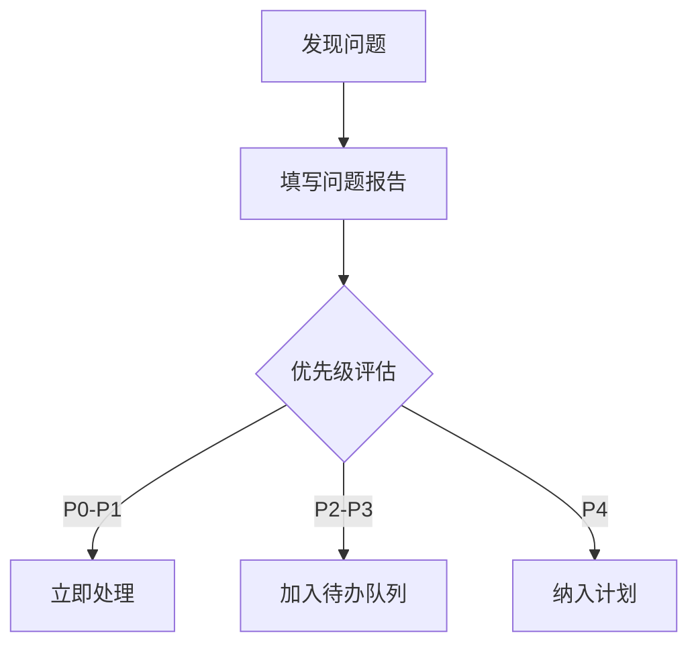
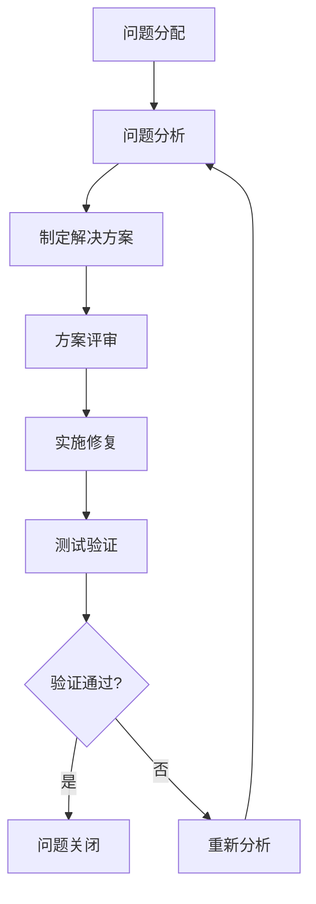

# 胧压缩·方便助手 - 问题跟踪模板

## 问题分类和优先级

### 问题类型
- **Bug**: 功能缺陷、错误行为
- **功能需求**: 新功能请求、功能改进
- **技术债务**: 代码质量、架构问题
- **文档**: 文档缺失、错误、不清晰
- **性能**: 性能问题、资源使用过高
- **安全**: 安全漏洞、权限问题
- **用户体验**: 界面问题、交互问题
- **集成**: 第三方集成、系统兼容性

### 优先级定义
- **P0 - 紧急**: 系统崩溃、数据丢失、安全漏洞，必须立即修复
- **P1 - 高**: 核心功能不可用、严重影响用户体验，24小时内修复
- **P2 - 中**: 功能受限、体验问题，3天内修复
- **P3 - 低**: 优化建议、非关键问题，1周内修复
- **P4 - 计划**: 新功能、改进建议，纳入后续版本计划

## 问题报告模板

### Bug报告模板
```markdown
# Bug报告

## 基本信息
- **问题ID**: [系统自动生成]
- **报告人**: [姓名]
- **报告日期**: [YYYY-MM-DD]
- **优先级**: P[0-4]
- **问题类型**: Bug

## 问题描述
[清晰描述问题现象，包括什么情况下发生、具体表现]

## 重现步骤
1. [步骤1]
2. [步骤2]
3. [步骤3]
[如果无法重现，说明尝试过的步骤]

## 预期行为
[期望的正确行为]

## 实际行为
[实际发生的错误行为]

## 环境信息
- **操作系统**: [Windows 11 / macOS / Linux]
- **应用版本**: [v1.0.0]
- **Tauri版本**: [2.0.0]
- **Node版本**: [18.0.0]
- **Rust版本**: [1.75.0]
- **其他相关信息**: [硬件配置、网络环境等]

## 影响范围
- **影响用户**: [所有用户 / 特定用户]
- **影响功能**: [具体功能模块]
- **业务影响**: [对业务的影响程度]

## 截图/日志
[相关截图或错误日志]
```
[错误日志]
```
[粘贴错误日志]
```

## 临时解决方案
[如果有临时解决方案，请描述]

## 相关链接
- 相关任务: #[任务ID]
- 相关PR: #[PR编号]
- 相关Issue: #[Issue编号]
```

### 功能需求模板
```markdown
# 功能需求

## 基本信息
- **需求ID**: [系统自动生成]
- **提出人**: [姓名]
- **提出日期**: [YYYY-MM-DD]
- **优先级**: P[0-4]
- **问题类型**: 功能需求

## 需求背景
[为什么需要这个功能，解决什么问题]

## 需求描述
[详细描述需求内容，包括功能要点]

## 用户场景
**场景1**: [用户角色] 想要 [目标] 以便 [价值]
**场景2**: [用户角色] 想要 [目标] 以便 [价值]

## 功能要求
### 必须功能
1. [功能点1]
2. [功能点2]

### 可选功能
1. [功能点1]
2. [功能点2]

## 验收标准
1. [标准1：可验证的具体条件]
2. [标准2：可验证的具体条件]

## 技术考虑
- **前端影响**: [对前端的影响]
- **后端影响**: [对后端的影响]
- **数据库影响**: [对数据库的影响]
- **性能影响**: [性能方面的考虑]

## 相关链接
- 相关任务: #[任务ID]
- 相关文档: [文档链接]
- 类似功能: [类似功能参考]
```

### 技术债务模板
```markdown
# 技术债务

## 基本信息
- **债务ID**: [系统自动生成]
- **提出人**: [姓名]
- **提出日期**: [YYYY-MM-DD]
- **优先级**: P[0-4]
- **问题类型**: 技术债务

## 问题描述
[描述技术债务的具体表现]

## 当前实现
[当前实现的描述，包括代码位置]

## 问题分析
### 代码质量问题
- [具体问题1]
- [具体问题2]

### 架构问题
- [具体问题1]
- [具体问题2]

### 性能问题
- [具体问题1]
- [具体问题2]

## 影响评估
- **代码维护性**: [影响程度]
- **系统性能**: [影响程度]
- **开发效率**: [影响程度]
- **系统稳定性**: [影响程度]

## 改进方案
### 方案1: [方案名称]
**描述**: [方案描述]
**优点**:
- [优点1]
- [优点2]
**缺点**:
- [缺点1]
- [缺点2]
**工作量**: [估算工作量]

### 方案2: [方案名称]
[类似描述]

## 推荐方案
[推荐方案及理由]

## 实施计划
1. [步骤1]
2. [步骤2]
3. [步骤3]

## 相关链接
- 相关代码: [代码文件路径]
- 相关文档: [文档链接]
- 相关任务: #[任务ID]
```

## 问题处理流程

### 1. 问题提交


### 2. 问题分配
- **P0问题**: 立即分配给相关技术负责人
- **P1问题**: 2小时内分配给相关开发人员
- **P2问题**: 当天分配给相关开发人员
- **P3问题**: 本周内安排处理
- **P4问题**: 纳入版本计划

### 3. 问题处理


### 4. 问题验证
- **验证人**: 非问题修复人员
- **验证标准**: 按照验收标准验证
- **验证环境**: 测试环境或开发环境
- **验证记录**: 记录验证过程和结果

### 5. 问题关闭
- **关闭条件**: 问题修复并通过验证
- **关闭记录**: 记录修复方案和验证结果
- **知识沉淀**: 更新相关文档

## 问题状态跟踪

### 状态定义
- **新建**: 问题已提交，待分配
- **已分配**: 问题已分配给处理人
- **处理中**: 处理人正在解决问题
- **待验证**: 问题已修复，待验证
- **已验证**: 问题已通过验证
- **已关闭**: 问题已解决并关闭
- **重新打开**: 问题重新出现
- **延期**: 问题延期处理
- **无法重现**: 问题无法重现
- **设计如此**: 当前行为是设计预期

### 状态流转
```
新建 → 已分配 → 处理中 → 待验证 → 已验证 → 已关闭
    ↓          ↓          ↓
延期 ←─────┘         重新打开
```

## 问题跟踪表

### 问题列表模板
| 问题ID | 标题 | 类型 | 优先级 | 状态 | 负责人 | 创建日期 | 预计完成 | 实际完成 |
|--------|------|------|--------|------|--------|----------|----------|----------|
| BUG-001 | ZIP解压密码错误时崩溃 | Bug | P1 | 处理中 | 后端工程师1 | 2026-03-09 | 2026-03-10 | - |
| FEAT-001 | 添加批量文件处理功能 | 功能需求 | P2 | 已分配 | 前端工程师1 | 2026-03-09 | 2026-03-15 | - |
| TECH-001 | 数据库连接池优化 | 技术债务 | P3 | 新建 | 后端工程师2 | 2026-03-09 | 2026-03-20 | - |
| DOC-001 | 更新API文档 | 文档 | P2 | 处理中 | 后端工程师1 | 2026-03-08 | 2026-03-11 | - |

### 问题详情模板
```markdown
# 问题详情: BUG-001

## 基本信息
- **标题**: ZIP解压密码错误时崩溃
- **类型**: Bug
- **优先级**: P1
- **状态**: 处理中
- **负责人**: 后端工程师1
- **创建人**: QA工程师
- **创建日期**: 2026-03-09
- **预计完成**: 2026-03-10

## 问题描述
当解压带密码的ZIP文件时，如果密码错误，应用会崩溃而不是显示错误信息。

## 重现步骤
1. 准备一个带密码的ZIP文件
2. 在应用中选择该文件
3. 输入错误密码
4. 点击解压按钮
5. 应用崩溃

## 当前进展
### 2026-03-09 10:30
- 问题分配给后端工程师1
- 开始分析崩溃原因

### 2026-03-09 14:00
- 定位到问题在compression_service.rs第97行
- 错误处理逻辑缺失，导致panic

## 解决方案
### 修复方案
在compression_service.rs中添加适当的错误处理：
```rust
if file.is_encrypted() {
    if let Some(pwd) = password {
        if file.set_password(pwd) {
            // 密码设置成功
        } else {
            return Err(anyhow::anyhow!("密码错误"));
        }
    } else {
        return Err(anyhow::anyhow!("ZIP文件需要密码"));
    }
}
```

### 测试方案
1. 单元测试：测试密码错误场景
2. 集成测试：测试带密码ZIP解压流程
3. 手动测试：验证错误信息显示

## 相关链接
- 相关代码: `src-tauri/src/services/compression_service.rs`
- 相关任务: #BE-007
- PR: #45
```

## 问题统计和分析

### 每周问题统计
| 周次 | Bug数量 | 功能需求 | 技术债务 | 文档问题 | 总计 | 解决率 |
|------|---------|----------|----------|----------|------|--------|
| 第1周 | 5 | 3 | 2 | 1 | 11 | 82% |
| 第2周 | 3 | 5 | 1 | 2 | 11 | 73% |
| 第3周 | 2 | 4 | 3 | 1 | 10 | 80% |

### 问题趋势分析
- **Bug趋势**: 每周递减，质量提升
- **功能需求**: 随着开发深入逐渐增加
- **技术债务**: 中期达到高峰，后期减少
- **解决率**: 保持在80%左右

### 根本原因分析
| 问题类型 | 常见原因 | 预防措施 |
|----------|----------|----------|
| Bug | 边界条件未处理 | 加强单元测试覆盖 |
| 功能需求 | 需求理解不一致 | 加强需求评审 |
| 技术债务 | 开发时间压力 | 预留技术债务处理时间 |
| 文档问题 | 文档更新不及时 | 文档与代码同步更新 |

## 工具支持

### 推荐工具
1. **问题跟踪**: GitHub Issues、Jira、Trello
2. **文档管理**: Confluence、Notion、Wiki
3. **代码管理**: GitHub、GitLab
4. **沟通协作**: Slack、钉钉、飞书

### 自动化支持
1. **问题模板**: 自动生成问题报告模板
2. **状态同步**: 自动同步问题状态到跟踪表
3. **提醒通知**: 逾期问题自动提醒
4. **统计报告**: 自动生成问题统计报告

## 最佳实践

### 问题报告
1. **一个问题一个报告**: 不要混合多个问题
2. **提供完整信息**: 包括环境、步骤、日志
3. **使用模板**: 确保信息完整性和一致性
4. **附加证据**: 截图、日志、录屏等

### 问题处理
1. **及时响应**: P0-P1问题立即响应
2. **定期更新**: 每天更新问题状态
3. **沟通透明**: 及时同步处理进展
4. **知识沉淀**: 解决问题后更新文档

### 问题预防
1. **代码审查**: 提前发现潜在问题
2. **自动化测试**: 减少回归问题
3. **需求评审**: 减少需求理解偏差
4. **技术评审**: 减少技术债务

## 紧急问题处理流程

### P0问题处理流程
1. **立即响应**: 5分钟内确认问题
2. **紧急会议**: 15分钟内召开紧急会议
3. **制定方案**: 30分钟内制定解决方案
4. **实施修复**: 立即实施修复
5. **验证发布**: 修复后立即验证和发布
6. **事后分析**: 24小时内进行根本原因分析

### 紧急联系人
| 角色 | 姓名 | 联系方式 | 备份联系人 |
|------|------|----------|------------|
| 项目管理领队 | [姓名] | [电话/钉钉] | [备份姓名] |
| 技术负责人 | [姓名] | [电话/钉钉] | [备份姓名] |
| 前端负责人 | [姓名] | [电话/钉钉] | [备份姓名] |
| 后端负责人 | [姓名] | [电话/钉钉] | [备份姓名] |

---
**文档版本**: v1.0
**创建日期**: 2026-03-08
**更新日期**: 2026-03-08
**负责人**: 项目管理领队