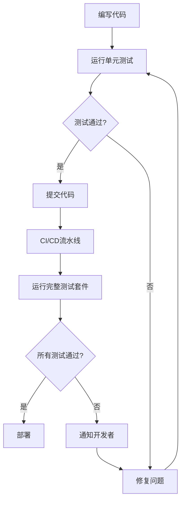

# 胧压缩·方便助手 - 测试指南

## 概述

本文档定义了"胧压缩·方便助手"项目的测试框架、流程和标准。旨在确保代码质量、功能正确性和性能表现。

## 测试架构

### 测试金字塔
```
        E2E测试 (10%)
           ↑
    集成测试 (20%)
           ↑
    单元测试 (70%)
```

### 测试类型

#### 1. 单元测试 (Unit Tests)
- **位置**: `src/**/__tests__/` 和 `src-tauri/tests/unit/`
- **范围**: 单个函数、类、组件
- **工具**:
  - Rust: `cargo test`, `mockall`
  - Vue: `Vitest`, `@vue/test-utils`
- **目标**: 70%+ 代码覆盖率

#### 2. 集成测试 (Integration Tests)
- **位置**: `tests/integration/`
- **范围**: 模块间交互、API调用
- **工具**: `Vitest`, `tauri/test`
- **目标**: 验证系统组件协同工作

#### 3. 端到端测试 (E2E Tests)
- **位置**: `tests/e2e/`
- **范围**: 完整用户流程
- **工具**: `Playwright`
- **目标**: 验证真实用户场景

#### 4. 性能测试 (Performance Tests)
- **位置**: `src-tauri/benches/`, `tests/performance/`
- **范围**: 性能基准、负载测试
- **工具**: `criterion`, 自定义脚本
- **目标**: 确保性能达标

## 测试流程

### 开发阶段测试流程



### 1. 本地开发测试

#### 1.1 运行所有测试
```bash
# 前端测试
npm test

# Rust后端测试
cd src-tauri && cargo test

# 性能基准测试
cd src-tauri && cargo bench
```

#### 1.2 运行特定测试
```bash
# 运行单个测试文件
npm run test:unit -- FileUpload.test.ts

# 运行测试套件
npm run test:unit -- --run compression

# 带覆盖率
npm run test:unit:coverage
```

#### 1.3 开发时监控
```bash
# 监视模式（文件变化时自动运行）
npm run test:unit:watch

# 运行E2E测试UI
npm run test:e2e:ui
```

### 2. 持续集成流程

#### 2.1 GitHub Actions 工作流
```yaml
name: Test Suite
on: [push, pull_request]

jobs:
  test:
    runs-on: ubuntu-latest
    steps:
      - name: Checkout code
        uses: actions/checkout@v3

      - name: Setup Node.js
        uses: actions/setup-node@v3
        with:
          node-version: '18'

      - name: Install dependencies
        run: npm ci

      - name: Run unit tests
        run: npm run test:unit

      - name: Run integration tests
        run: npm run test:integration

      - name: Generate coverage report
        run: npm run test:unit:coverage

      - name: Upload coverage
        uses: codecov/codecov-action@v3
```

#### 2.2 Rust测试工作流
```yaml
rust-test:
  runs-on: ubuntu-latest
  steps:
    - uses: actions/checkout@v3

    - name: Install Rust
      uses: actions-rs/toolchain@v1
      with:
        toolchain: stable
        override: true

    - name: Run tests
      run: cd src-tauri && cargo test --verbose

    - name: Run benchmarks
      run: cd src-tauri && cargo bench
```

### 3. 代码审查测试要求

#### 3.1 提交前检查清单
- [ ] 所有单元测试通过
- [ ] 新增代码有对应测试
- [ ] 代码覆盖率不低于现有水平
- [ ] 集成测试通过
- [ ] 无性能回归

#### 3.2 Pull Request 要求
- **必须包含**: 相关功能的测试
- **必须通过**: CI/CD流水线所有测试
- **建议包含**: 性能测试结果
- **禁止合并**: 测试覆盖率下降

## 测试标准

### 1. 单元测试标准

#### 1.1 Rust单元测试
```rust
#[cfg(test)]
mod tests {
    use super::*;
    use mockall::predicate::*;

    #[test]
    fn test_function_name() {
        // Arrange - 准备测试数据
        let input = "test";

        // Act - 执行测试
        let result = function_under_test(input);

        // Assert - 验证结果
        assert_eq!(result, expected_value);
        assert!(condition);
    }

    #[tokio::test]
    async fn test_async_function() {
        // 异步测试
    }
}
```

#### 1.2 Vue组件测试标准
```typescript
describe('ComponentName', () => {
  it('should render correctly', () => {
    const wrapper = mount(ComponentName, { props: { /* props */ } })
    expect(wrapper.exists()).toBe(true)
  })

  it('should handle user interaction', async () => {
    const wrapper = mount(ComponentName)
    await wrapper.find('button').trigger('click')
    expect(wrapper.emitted('event-name')).toBeTruthy()
  })
})
```

### 2. 集成测试标准

#### 2.1 测试场景
- 前后端通信
- 数据库操作
- 文件系统操作
- 外部API调用

#### 2.2 测试数据
- 使用测试数据库
- 临时文件系统
- Mock外部服务

### 3. 性能测试标准

#### 3.1 基准要求
| 操作类型 | 文件大小 | 最大时间 | 最大内存 |
|---------|---------|---------|---------|
| 压缩 | 10MB | 3秒 | 50MB |
| 解压 | 10MB | 2秒 | 30MB |
| 批量处理 | 100MB | 15秒 | 200MB |

#### 3.2 监控指标
- CPU使用率
- 内存使用量
- 磁盘I/O
- 响应时间
- 吞吐量

## 测试工具配置

### 1. Vitest配置 (`vitest.config.ts`)
```typescript
export default defineConfig({
  test: {
    globals: true,
    environment: 'jsdom',
    coverage: {
      provider: 'v8',
      reporter: ['text', 'json', 'html'],
      exclude: ['node_modules', 'dist'],
    },
  },
})
```

### 2. Playwright配置 (`playwright.config.ts`)
```typescript
export default defineConfig({
  testDir: './tests/e2e',
  fullyParallel: true,
  reporter: 'html',
  use: {
    baseURL: 'http://localhost:5173',
    trace: 'on-first-retry',
  },
})
```

### 3. Cargo测试配置
```toml
[dev-dependencies]
mockall = "0.12"
criterion = "0.5"
tempfile = "3.10"
```

## 测试数据管理

### 1. 测试文件生成
```bash
# 生成测试数据
./scripts/generate_test_files.sh

# 测试文件类型
- 文本文件 (.txt, .md, .json)
- 压缩文件 (.zip, .tar.gz, .7z)
- 二进制文件 (.bin, .dat)
- 大文件 (10MB, 100MB, 1GB)
```

### 2. 测试数据库
- 使用SQLite内存数据库
- 每个测试用例独立数据库
- 测试后自动清理

### 3. 临时文件
- 使用`tempfile` crate创建临时文件
- 测试后自动删除
- 避免文件系统污染

## 常见测试模式

### 1. Mock模式
```rust
// 使用mockall模拟外部依赖
mock! {
    pub ExternalService {
        fn call(&self, param: String) -> Result<String, Error>;
    }
}

#[test]
fn test_with_mock() {
    let mut mock = MockExternalService::new();
    mock.expect_call()
        .with(eq("test".to_string()))
        .returning(|_| Ok("mocked".to_string()));
}
```

### 2. 参数化测试
```rust
#[test_case("test1", "expected1")]
#[test_case("test2", "expected2")]
fn test_multiple_cases(input: &str, expected: &str) {
    assert_eq!(process(input), expected);
}
```

### 3. 属性测试
```rust
use proptest::prelude::*;

proptest! {
    #[test]
    fn test_compression_roundtrip(data in any::<Vec<u8>>()) {
        let compressed = compress(&data);
        let decompressed = decompress(&compressed);
        prop_assert_eq!(data, decompressed);
    }
}
```

## 故障排除

### 1. 常见问题

#### 1.1 测试失败
```bash
# 查看详细输出
npm run test:unit -- --verbose

# 运行单个失败测试
npm run test:unit -- --run "test name"
```

#### 1.2 覆盖率问题
```bash
# 生成详细覆盖率报告
npm run test:unit:coverage

# 查看未覆盖代码
open coverage/lcov-report/index.html
```

#### 1.3 性能测试失败
```bash
# 运行基准测试
cd src-tauri && cargo bench

# 分析性能瓶颈
cd src-tauri && cargo flamegraph --bench compression
```

### 2. 调试技巧

#### 2.1 调试Rust测试
```rust
#[test]
fn test_with_debug() {
    // 使用dbg!宏
    let value = dbg!(calculate_something());
    assert_eq!(value, expected);
}
```

#### 2.2 调试Vue测试
```typescript
it('debug test', async () => {
  const wrapper = mount(Component)
  console.log(wrapper.html()) // 查看渲染结果
  console.log(wrapper.vm)     // 查看组件实例
})
```

## 最佳实践

### 1. 测试编写
- 每个测试一个断言（尽量）
- 使用描述性的测试名称
- 测试边界条件和错误情况
- 避免测试间依赖

### 2. 测试维护
- 定期更新测试数据
- 重构时更新测试
- 删除过时测试
- 保持测试快速运行

### 3. 团队协作
- 代码审查检查测试
- 分享测试技巧
- 建立测试知识库
- 定期回顾测试策略

## 附录

### A. 测试命令速查表

| 命令 | 描述 |
|------|------|
| `npm test` | 运行所有测试 |
| `npm run test:unit` | 运行单元测试 |
| `npm run test:unit:watch` | 监视模式运行单元测试 |
| `npm run test:unit:coverage` | 运行单元测试并生成覆盖率报告 |
| `npm run test:e2e` | 运行E2E测试 |
| `npm run test:e2e:ui` | 运行E2E测试UI |
| `cd src-tauri && cargo test` | 运行Rust测试 |
| `cd src-tauri && cargo bench` | 运行性能基准测试 |

### B. 测试目录结构
```
tests/
├── integration/          # 集成测试
├── e2e/                 # 端到端测试
├── performance/         # 性能测试
└── setup.ts            # 测试配置

src/
├── components/
│   └── __tests__/      # 组件测试
├── stores/
│   └── __tests__/      # Store测试
└── utils/
    └── __tests__/      # 工具函数测试

src-tauri/
├── tests/
│   ├── unit/           # Rust单元测试
│   └── integration/    # Rust集成测试
├── benches/            # 性能基准测试
└── Cargo.toml          # Rust依赖配置
```

### C. 参考资料
- [Vitest文档](https://vitest.dev/)
- [Playwright文档](https://playwright.dev/)
- [Rust测试指南](https://doc.rust-lang.org/book/ch11-00-testing.html)
- [Vue测试指南](https://vuejs.org/guide/scaling-up/testing.html)

---

*最后更新: 2026-03-08*
*版本: 1.0.0*