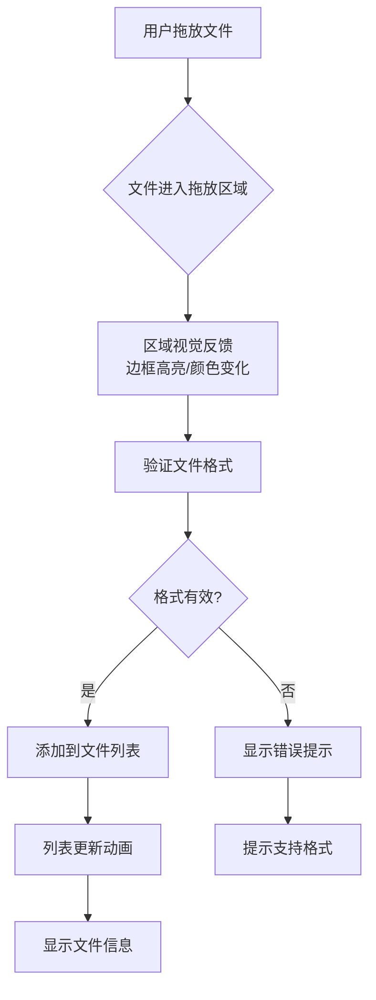
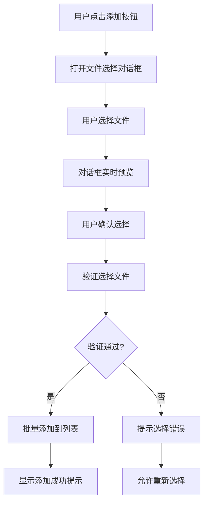
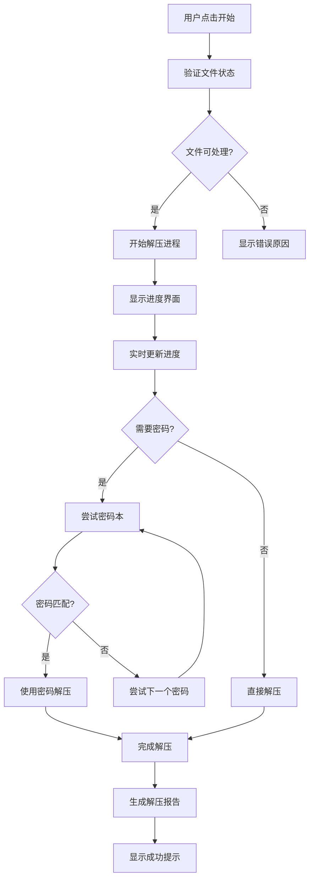
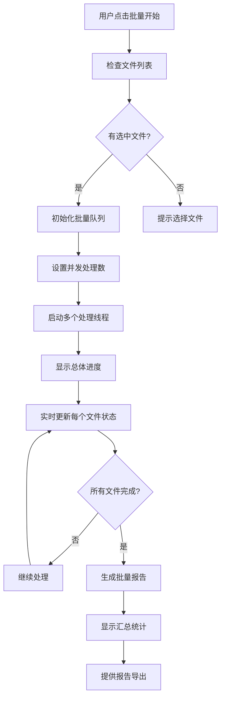
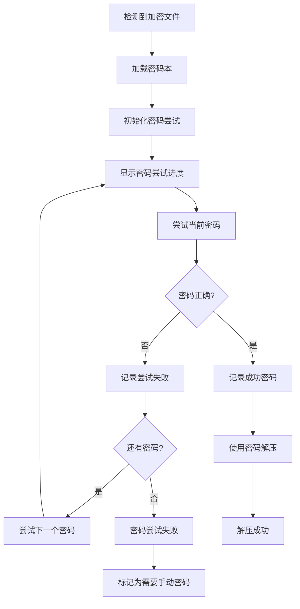
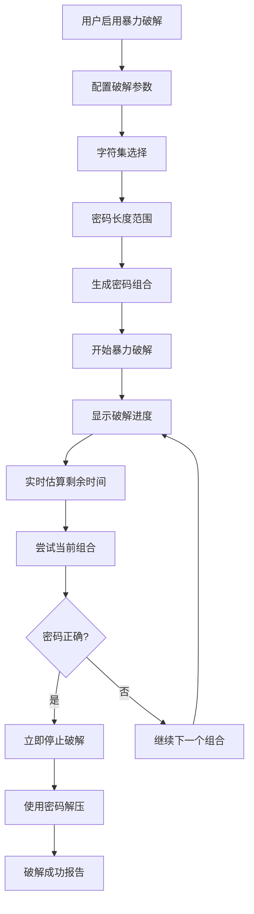

# 胧解压·方便助手 - 交互原型文档

## 1. 用户旅程地图

### 1.1 新手用户旅程
```
用户目标: 解压一个带密码的压缩文件

阶段          用户行为                界面反馈                系统处理
──────       ──────────────         ──────────────         ──────────────
发现         • 寻找解压工具          • 应用商店/网站展示     • 提供下载链接
             • 下载安装              • 安装向导              • 自动安装

入门         • 首次启动应用          • 欢迎界面/快速引导     • 检查系统环境
             • 了解基本功能          • 功能概览              • 初始化设置

添加文件     • 拖放文件到界面        • 拖放区域高亮          • 验证文件格式
             • 或点击添加文件        • 文件选择对话框        • 添加到处理队列

设置选项     • 选择输出目录          • 目录选择器            • 验证路径权限
             • 配置解压选项          • 选项面板              • 保存用户偏好

开始解压     • 点击开始按钮          • 按钮状态变化          • 启动解压进程
             • 等待处理完成          • 进度显示              • 实时处理文件

查看结果     • 查看解压报告          • 报告界面弹出          • 生成详细报告
             • 打开输出文件夹        • 文件夹打开            • 导航到输出目录

完成         • 关闭应用              • 确认保存设置          • 保存用户数据
             • 或继续处理其他文件    • 返回主界面            • 重置处理状态
```

### 1.2 高级用户旅程
```
用户目标: 批量处理多个压缩文件，使用密码本破解

阶段          用户行为                界面反馈                系统处理
──────       ──────────────         ──────────────         ──────────────
准备         • 打开应用              • 恢复上次会话          • 加载用户配置
             • 导入密码本文件        • 文件导入确认          • 解析密码本

批量添加     • 拖放文件夹            • 扫描进度显示          • 递归扫描文件
             • 或使用命令行参数      • 文件列表更新          • 验证所有文件

配置批量     • 设置批量输出规则      • 规则预览              • 验证规则有效性
             • 选择密码尝试策略      • 策略说明              • 准备密码组合

开始处理     • 点击批量开始          • 多文件进度显示        • 并发处理文件
             • 监控处理状态          • 实时统计更新          • 管理处理队列

中途调整     • 暂停特定文件          • 暂停确认              • 保存当前状态
             • 调整密码策略          • 策略调整界面          • 重新计算组合

完成查看     • 查看批量报告          • 汇总报告生成          • 聚合处理结果
             • 导出处理日志          • 导出选项              • 生成日志文件
             • 保存处理配置          • 配置保存确认          • 存储为模板
```

## 2. 关键交互流程

### 2.1 文件添加流程

#### 流程1: 拖放添加


#### 流程2: 文件选择对话框


### 2.2 解压处理流程

#### 流程3: 单个文件解压


#### 流程4: 批量文件处理


### 2.3 密码破解流程

#### 流程5: 密码本匹配


#### 流程6: 暴力破解模式


## 3. 界面状态转换

### 3.1 主界面状态机
```
状态: IDLE (空闲)
• 文件列表为空或全为待处理
• 开始按钮可用
• 暂停/停止按钮禁用

事件: 用户添加文件
→ 状态: READY (就绪)

状态: READY (就绪)
• 文件列表有待处理文件
• 开始按钮高亮
• 可配置解压选项

事件: 用户点击开始
→ 状态: PROCESSING (处理中)

状态: PROCESSING (处理中)
• 进度条动画
• 开始按钮变为暂停
• 实时显示统计信息
• 可暂停/停止

事件: 用户点击暂停
→ 状态: PAUSED (已暂停)

状态: PAUSED (已暂停)
• 进度条暂停
• 暂停按钮变为继续
• 显示暂停时间
• 可继续或停止

事件: 用户点击继续
→ 状态: PROCESSING (处理中)

事件: 用户点击停止
→ 状态: STOPPED (已停止)

状态: STOPPED (已停止)
• 进度条重置
• 显示停止原因
• 可重新开始或清除

事件: 处理完成
→ 状态: COMPLETED (已完成)

状态: COMPLETED (已完成)
• 显示完成提示
• 提供报告查看
• 可开始新的处理
```

### 3.2 文件项状态机
```
状态: PENDING (待处理)
• 灰色图标
• 可选中/取消选中
• 显示基本文件信息

事件: 开始处理该文件
→ 状态: PROCESSING (处理中)

状态: PROCESSING (处理中)
• 蓝色旋转图标
• 显示实时进度
• 可单独暂停

事件: 处理完成
→ 状态: SUCCESS (成功)

事件: 处理失败
→ 状态: FAILED (失败)

状态: SUCCESS (成功)
• 绿色对勾图标
• 显示成功信息
• 可打开输出目录

状态: FAILED (失败)
• 红色叉号图标
• 显示错误原因
• 可重试或跳过

事件: 用户重试
→ 状态: PENDING (待处理)
```

## 4. 错误处理流程

### 4.1 常见错误场景

#### 场景1: 文件格式不支持
```
用户操作: 拖放 .exe 文件
系统检测: 不是支持的压缩格式
界面反馈:
  1. 拖放区域显示错误图标
  2. 弹出提示: "不支持的文件格式"
  3. 建议: "请选择 ZIP, RAR, 7Z 等压缩文件"
用户选项:
  • 确定 (关闭提示)
  • 查看支持格式 (打开帮助)
恢复路径: 自动排除无效文件，继续处理其他文件
```

#### 场景2: 文件损坏
```
用户操作: 开始解压损坏的压缩文件
系统检测: CRC校验失败或文件头损坏
界面反馈:
  1. 文件状态变为"失败"
  2. 显示错误详情: "文件损坏，无法解压"
  3. 提供修复建议
用户选项:
  • 跳过此文件
  • 尝试修复 (如果支持)
  • 查看错误日志
恢复路径: 跳过损坏文件，继续处理队列
```

#### 场景3: 磁盘空间不足
```
用户操作: 解压大文件到小容量磁盘
系统检测: 写入时磁盘空间不足
界面反馈:
  1. 暂停当前处理
  2. 弹出警告: "磁盘空间不足"
  3. 显示需要空间和可用空间
用户选项:
  • 更改输出目录
  • 清理磁盘空间
  • 取消解压
恢复路径: 用户选择新目录后继续解压
```

#### 场景4: 权限不足
```
用户操作: 解压到系统保护目录
系统检测: 写入权限被拒绝
界面反馈:
  1. 显示权限错误
  2. 建议解决方案
  3. 提供以管理员身份运行选项
用户选项:
  • 选择其他目录
  • 以管理员身份重试
  • 取消操作
恢复路径: 根据用户选择调整权限或目录
```

### 4.2 错误恢复策略

#### 策略1: 自动重试
```yaml
可重试错误:
  - 临时文件锁
  - 网络波动 (云文件)
  - 短暂权限问题

重试策略:
  最大重试次数: 3
  重试间隔: 2秒, 5秒, 10秒 (指数退避)
  重试条件: 错误代码在可重试列表

用户反馈:
  显示重试中状态
  显示重试次数
  重试失败后显示最终错误
```

#### 策略2: 用户干预
```yaml
需要用户干预的错误:
  - 密码错误 (多次尝试后)
  - 磁盘空间不足
  - 文件路径无效

干预流程:
  1. 暂停相关处理
  2. 显示清晰错误说明
  3. 提供具体解决选项
  4. 等待用户选择
  5. 根据选择继续或取消

用户体验:
  保持其他文件处理继续
  允许跳过问题文件
  记住用户选择用于类似情况
```

## 5. 成功状态反馈

### 5.1 解压成功反馈
```
视觉反馈:
  • 文件项绿色对勾动画
  • 进度条完成动画 (从左到右填充)
  • 成功计数增加

听觉反馈 (可选):
  • 轻柔的成功提示音
  • 音量可配置

通知反馈:
  • 系统通知 (如果最小化)
  • 状态栏更新

后续操作:
  • "打开文件夹"按钮高亮
  • 报告查看入口显示
  • 继续处理下一个文件
```

### 5.2 批量完成反馈
```
总结显示:
  ┌─────────────────────────────────┐
  │ 批量处理完成!                   │
  │                                 │
  │ ✅ 成功: 8 个文件               │
  │ ⚠️  警告: 2 个文件 (部分内容)   │
  │ ❌ 失败: 1 个文件               │
  │                                 │
  │ 📊 查看详细报告                 │
  │ 📁 打开输出目录                 │
  │ 🔄 重新处理失败文件             │
  └─────────────────────────────────┘

自动操作:
  • 生成汇总报告
  • 保存处理日志
  • 更新历史记录

用户选择:
  • 立即查看报告
  • 处理其他文件
  • 导出处理结果
```

## 6. 加载和等待状态

### 6.1 文件扫描加载
```
场景: 用户添加包含大量文件的文件夹

加载状态设计:
  阶段1: 初始扫描
    • 显示"正在扫描文件夹..."
    • 旋转加载图标
    • 显示已发现文件数

  阶段2: 格式验证
    • 显示"验证文件格式..."
    • 进度条显示验证进度
    • 显示有效文件数

  阶段3: 添加到列表
    • 显示"准备文件列表..."
    • 列表项渐入动画
    • 显示最终文件数

用户可操作:
  • 取消扫描
  • 最小化窗口 (后台继续)
  • 查看扫描详情
```

### 6.2 密码尝试等待
```
场景: 暴力破解复杂密码

等待状态设计:
  实时信息:
    • 当前尝试密码
    • 尝试进度 (X/Y 组合)
    • 估算剩余时间
    • 尝试速度 (密码/秒)

  进度可视化:
    • 总体进度条
    • 当前字符集进度
    • 密码长度进度

  用户控制:
    • 暂停/继续破解
    • 调整破解参数
    • 保存当前进度
    • 停止破解

  性能提示:
    • CPU使用率
    • 内存使用情况
    • 建议优化设置
```

## 7. 确认对话框设计

### 7.1 覆盖确认
```
场景: 解压文件到已存在文件的目录

对话框设计:
  ┌─────────────────────────────────┐
  │ ⚠️  文件已存在                  │
  │                                 │
  │ 目标文件已存在:                │
  │   output/document.txt          │
  │                                 │
  │ 请选择操作:                    │
  │                                 │
  │  ○ 覆盖此文件                   │
  │  ○ 重命名新文件                 │
  │  ○ 跳过此文件                   │
  │  ○ 应用到所有冲突文件          │
  │                                 │
  │  [取消]        [确认]           │
  └─────────────────────────────────┘

智能默认:
  • 记住用户选择
  • 根据文件新旧建议
  • 批量操作时提供"全部应用"
```

### 7.2 删除确认
```
场景: 用户要清空文件列表

对话框设计:
  ┌─────────────────────────────────┐
  │ ❗ 确认删除                     │
  │                                 │
  │ 您将要删除 5 个文件:           │
  │   • archive1.zip (处理中)      │
  │   • archive2.rar (已完成)      │
  │   • archive3.7z (等待中)       │
  │                                 │
  │ 这将:                          │
  │   • 停止正在处理的任务         │
  │   • 删除文件记录               │
  │   • 无法撤销                   │
  │                                 │
  │  [取消]        [删除]           │
  └─────────────────────────────────┘

危险操作保护:
  • 红色强调删除按钮
  • 需要额外确认步骤
  • 提供撤销期限 (短时间内)
```

## 8. 向导式流程

### 8.1 首次使用向导
```
步骤1: 欢迎
  • 应用介绍和主要功能
  • 快速开始指南

步骤2: 基本设置
  • 选择默认输出目录
  • 配置常用选项
  • 设置界面主题

步骤3: 密码本设置
  • 导入常用密码
  • 设置密码策略
  • 测试密码功能

步骤4: 尝试解压
  • 提供示例文件
  • 引导完成第一次解压
  • 展示报告功能

步骤5: 完成
  • 总结学习内容
  • 提供帮助资源
  • 可选高级设置
```

### 8.2 批量处理向导
```
步骤1: 文件选择
  • 添加文件/文件夹
  • 文件筛选和排序
  • 预览选择结果

步骤2: 输出设置
  • 设置输出目录结构
  • 配置命名规则
  • 设置冲突处理

步骤3: 处理选项
  • 选择解压模式
  • 配置密码策略
  • 设置性能参数

步骤4: 预览确认
  • 显示处理计划摘要
  • 估算处理时间和资源
  • 最后确认

步骤5: 开始处理
  • 显示处理进度
  • 提供中途调整
  • 完成后显示报告
```

## 9. 键盘快捷键交互

### 9.1 全局快捷键
```
文件操作:
  Ctrl+O     打开文件选择对话框
  Ctrl+D     聚焦到拖放区域
  Ctrl+S     开始处理选中文件
  Ctrl+P     暂停/继续处理
  Ctrl+E     停止处理
  Ctrl+R     查看最近报告
  Ctrl+L     清空文件列表

导航:
  Tab        在界面元素间导航
  Shift+Tab  反向导航
  Enter      激活当前焦点元素
  Esc        关闭对话框/取消操作
  F1         打开帮助
  F5         刷新文件列表

选择:
  Ctrl+A     全选文件列表
  Space      切换当前项选中状态
  ↑/↓       在列表中上下移动
  Home/End   跳到列表开头/结尾
```

### 9.2 上下文快捷键
```
文件列表上下文 (当列表聚焦时):
  Delete     移除选中文件
  Enter      开始处理选中文件
  F2         重命名选中文件
  Ctrl+C     复制文件信息

进度界面上下文 (当处理中):
  Space      暂停/继续
  S          停止处理
  R          查看实时报告

报告界面上下文:
  Ctrl+C     复制报告摘要
  Ctrl+P     打印报告
  Ctrl+E     导出报告
  Ctrl+F     在报告中搜索
```

## 10. 触摸交互优化

### 10.1 手势支持
```
基础手势:
  • 轻点: 选择/激活
  • 长按: 显示上下文菜单
  • 滑动: 滚动列表
  • 双指缩放: 调整界面缩放

高级手势:
  • 从边缘滑入: 显示侧边栏
  • 下拉刷新: 刷新文件列表
  • 左右滑动: 在标签间切换
  • 捏合: 调整列表项大小

触觉反馈:
  • 轻触: 轻微震动
  • 成功操作: 成功震动模式
  • 错误操作: 错误震动模式
```

### 10.2 触摸目标大小
```
最小触摸目标: 44×44 像素

界面元素尺寸:
  • 按钮: 至少 44×44
  • 列表项: 高度至少 44
  • 复选框: 44×44 (点击区域)
  • 图标按钮: 44×44

间距要求:
  • 元素间间距: 至少 8 像素
  • 避免密集排列
  • 提供足够操作空间

触摸友好设计:
  • 大点击区域
  • 避免微小控件
  • 手势冲突处理
  • 误触保护
```

---

**原型版本**: v1.0
**创建时间**: 2026-03-08
**测试建议**: 用户测试所有关键流程，特别是错误处理和边界情况