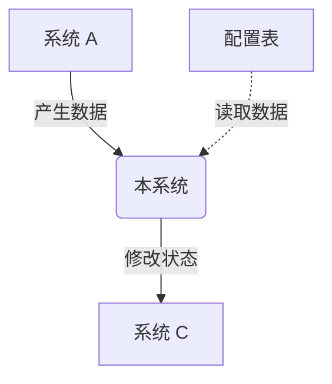
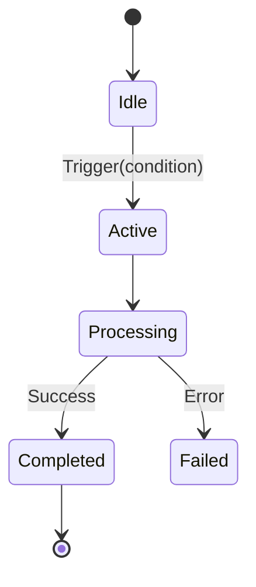

# 逻辑流转与系统耦合图

## 1. 系统依赖拓扑 (System Topology)

```mermaid
graph TD
    A[系统 A] -->|产生数据| B(本系统)
    B -->|修改状态| C[系统 C]
    D[配置表] -.->|读取数据| B
```

## 2. 数据生命周期/状态机 (State Machine)

```mermaid
stateDiagram-v2
    [*] --> Idle
    Idle --> Active : Trigger(condition)
    Active --> Processing
    Processing --> Completed : Success
    Processing --> Failed : Error
    Completed --> [*]
```